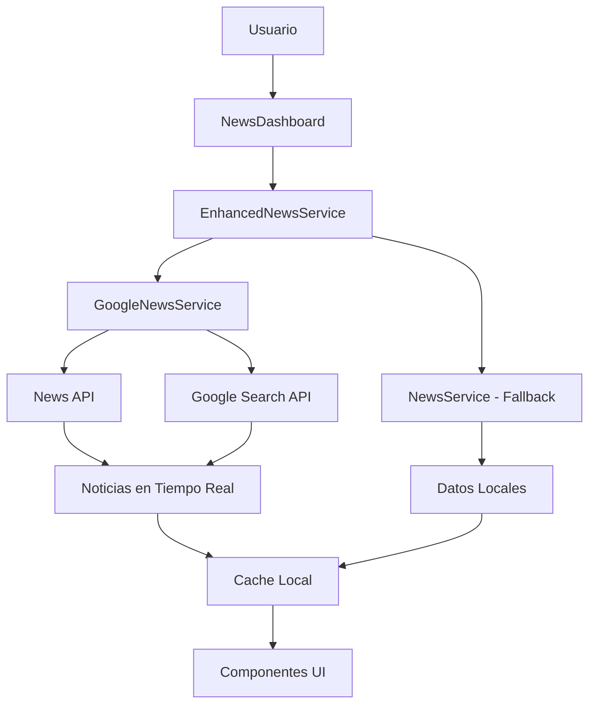

# 🇨🇴 Nuestro Pulso - Plataforma Cívica de Colombia

**La plataforma de noticias y participación cívica más avanzada de Colombia**


## 🚀 Características Principales

### 📰 **Noticias en Tiempo Real**
- **9 Categorías Completas**: Local, Mundial, Política, Congreso, Economía, Seguridad, Legislación, El Pulso, y más
- **Actualizaciones en Vivo**: Indicadores de frescura que muestran "actualizado hace X segundos"
- **Perspectivas Balanceadas**: Análisis progresista, conservador y balanceado de cada noticia
- **Fuentes Múltiples**: Integración con Google News API, News API y fuentes colombianas verificadas

### 🎨 **Diseño Colombiano Auténtico**
- **Branding de Bandera**: Gradientes y colores inspirados en la bandera colombiana (amarillo, azul, rojo)
- **Micro-interacciones**: Animaciones suaves, efectos hover y transiciones fluidas
- **Mobile-First**: Diseño responsivo optimizado para dispositivos móviles
- **Sombras Temáticas**: Efectos de sombra personalizados con colores de la bandera

### 🔍 **Búsqueda y Filtrado Avanzado**
- **Búsqueda Inteligente**: Búsqueda en tiempo real por título, contenido y etiquetas
- **Filtros Múltiples**: Por categoría, perspectiva, fuente y período de tiempo
- **Resultados Instantáneos**: Filtrado dinámico sin recarga de página
- **Estado Persistente**: Los filtros se mantienen durante la navegación

### 📊 **Dashboard Interactivo**
- **Estadísticas en Vivo**: Contadores de noticias totales, trending, última hora y filtradas
- **Indicadores Visuales**: Badges animados para noticias trending y de última hora
- **Gestión de Errores**: Mensajes amigables cuando las fuentes no están disponibles
- **Actualización Manual**: Botón de actualización para refrescar contenido

## 🛠️ Configuración del Proyecto

### 📋 Prerrequisitos
- Node.js 18.x o superior
- npm o yarn
- Claves de API para servicios de noticias (opcional para desarrollo)

### ⚡ Instalación Rápida

```bash
# Clonar el repositorio
git clone https://github.com/Colombia-cyber/nuestro-pulso-test.git
cd nuestro-pulso-test

# Instalación automática (recomendado)
bash setup.sh

# O instalación manual
npm install
cp .env.example .env
npm run dev
```

### 🔑 Configuración de APIs (Para Producción)

Para habilitar noticias en tiempo real, configura las siguientes variables en tu archivo `.env`:

```bash
# Google News API (Recomendado)
REACT_APP_NEWS_API_KEY=tu_clave_de_news_api
REACT_APP_GOOGLE_SEARCH_API_KEY=tu_clave_de_google_search
REACT_APP_GOOGLE_SEARCH_ENGINE_ID=tu_motor_de_busqueda_personalizado

# Configuración de Actualización
REACT_APP_NEWS_UPDATE_INTERVAL=30000  # 30 segundos
REACT_APP_ENABLE_LIVE_UPDATES=true
REACT_APP_ENABLE_FRESHNESS_INDICATORS=true

# Fuentes Colombianas Prioritarias
REACT_APP_COLOMBIA_NEWS_SOURCES=el-tiempo,semana,caracol-radio,rcn-radio,portafolio,la-republica,el-espectador
```

#### 🔐 Obtener Claves de API

**1. News API** (https://newsapi.org)
- Regístrate en NewsAPI.org
- Obtén tu clave gratuita (30,000 solicitudes/mes)
- Añádela como `REACT_APP_NEWS_API_KEY`

**2. Google Custom Search** (https://developers.google.com/custom-search)
- Crea un proyecto en Google Cloud Console
- Habilita Custom Search API
- Crea un motor de búsqueda personalizado
- Obtén tu API key y Search Engine ID

**3. Firebase** (Para comentarios y autenticación)
- Crea un proyecto en Firebase Console
- Configura Authentication y Firestore
- Añade las credenciales a las variables REACT_APP_FIREBASE_*

### 🚀 Scripts Disponibles

```bash
# Desarrollo
npm run dev          # Servidor de desarrollo (puerto 5173)
npm run dev:full     # Servidor completo con backend

# Construcción
npm run build        # Construir para producción
npm run preview      # Previsualizar build de producción

# Calidad de Código
npm run lint         # Ejecutar ESLint
npm run test         # Ejecutar pruebas (si están configuradas)

# Servidor Backend
npm run server       # Ejecutar servidor Express (puerto 3001)
```

## 🏗️ Arquitectura del Sistema

### 📁 Estructura de Directorios

```
src/
├── components/           # Componentes React reutilizables
│   ├── NewsDashboard.tsx    # Dashboard principal de noticias
│   ├── EnhancedNewsCard.tsx # Tarjetas de noticias mejoradas
│   ├── FreshnessIndicator.tsx # Indicadores de actualización
│   └── ...
├── services/            # Servicios de datos
│   ├── googleNewsService.ts  # Integración Google News API
│   ├── enhancedNewsService.ts # Servicio unificado con fallbacks
│   └── newsService.ts        # Servicio base con datos de respaldo
├── types/               # Definiciones TypeScript
│   ├── news.ts             # Tipos de noticias y artículos
│   └── ...
├── hooks/               # React Hooks personalizados
├── config/              # Configuración de la aplicación
└── data/                # Datos de respaldo y fallback
```

### 🔄 Flujo de Datos



## 🎯 Características Técnicas

### 🔧 **Servicios de Noticias**

**GoogleNewsService**
- Integración con múltiples APIs de noticias
- Búsquedas específicas por categoría y región
- Conversión automática a formato interno
- Manejo de límites de API y timeouts

**EnhancedNewsService**
- Servicio unificado con cache inteligente
- Fallback automático a datos locales
- Actualizaciones en tiempo real
- Gestión de errores robusta

### 📱 **Componentes UI**

**NewsDashboard**
- Dashboard principal con filtrado avanzado
- Estadísticas en tiempo real
- Búsqueda instantánea
- Responsive design

**EnhancedNewsCard**
- Tarjetas animadas con branding colombiano
- Indicadores de trending y última hora
- Acciones de usuario (like, compartir, guardar)
- Modal de artículo completo

**FreshnessIndicator**
- Indicadores de tiempo real
- Animaciones para contenido en vivo
- Actualización automática cada 30 segundos

### 🎨 **Sistema de Diseño**

**Colores Colombianos**
```css
colombia: {
  yellow: '#FFCE00',
  blue: '#003087', 
  red: '#C8102E'
}
```

**Gradientes Temáticos**
- `gradient-colombia`: Gradiente completo de bandera
- `colombian-flag`: Sombras con colores de bandera
- `perspective`: Colores por perspectiva política

## 🌐 Despliegue

### 🚀 **Vercel** (Recomendado)

```bash
# Instalar Vercel CLI
npm i -g vercel

# Desplegar
vercel

# Variables de entorno
vercel env add REACT_APP_NEWS_API_KEY production
vercel env add REACT_APP_GOOGLE_SEARCH_API_KEY production
# ... agregar todas las variables necesarias
```

### 🌍 **Netlify**

```bash
# Build command
npm run build

# Publish directory  
dist

# Variables de entorno
# Agregar en Netlify Dashboard -> Site settings -> Environment variables
```

### 🐳 **Docker**

```dockerfile
FROM node:18-alpine
WORKDIR /app
COPY package*.json ./
RUN npm ci --only=production
COPY . .
RUN npm run build
EXPOSE 5173
CMD ["npm", "run", "preview"]
```

## 🔒 Mejores Prácticas de Seguridad

### 🛡️ **Variables de Entorno**
- ❌ **NUNCA** commits claves reales al repositorio
- ✅ Usa `.env.example` con valores de placeholder
- ✅ Configura variables en el panel de tu proveedor de hosting
- ✅ Usa diferentes claves para desarrollo/producción

### 🔐 **Claves de API**
- 🔑 Implementa rotación regular de claves
- 📊 Monitorea uso de API para detectar anomalías
- 🚧 Configura límites de rate limiting
- 🔍 Usa HTTPS siempre en producción

### 🛠️ **Configuración de Firebase**
```javascript
// firebase.js - Configuración segura
const firebaseConfig = {
  apiKey: import.meta.env.REACT_APP_FIREBASE_API_KEY,
  authDomain: import.meta.env.REACT_APP_FIREBASE_AUTH_DOMAIN,
  // ... resto de configuración
};

// Reglas de Firestore recomendadas
rules_version = '2';
service cloud.firestore {
  match /databases/{database}/documents {
    match /comments/{document} {
      allow read: if true;
      allow write: if request.auth != null;
    }
  }
}
```

## 🐛 Solución de Problemas

### ❓ **Problemas Comunes**

**"No news sources available"**
```bash
# Verificar variables de entorno
echo $REACT_APP_NEWS_API_KEY

# Verificar en el navegador
console.log(import.meta.env.REACT_APP_NEWS_API_KEY)

# Solución: Configurar claves API o usar datos de respaldo
```

**Error de CORS**
```bash
# Para desarrollo local, agregar proxy en vite.config.js
export default {
  server: {
    proxy: {
      '/api': 'http://localhost:3001'
    }
  }
}
```

**Límites de API excedidos**
```bash
# Configurar timeouts más largos
REACT_APP_NEWS_UPDATE_INTERVAL=60000  # 1 minuto
REACT_APP_FALLBACK_TIMEOUT_MS=10000   # 10 segundos
```

### 📞 **Soporte**

Para problemas técnicos:
1. 📋 Verifica la [documentación de APIs](https://newsapi.org/docs)
2. 🔍 Revisa los logs del navegador (F12 -> Console)
3. 🧪 Prueba con datos de respaldo primero
4. 📝 Crea un issue en GitHub con detalles del error

## 🤝 Contribuciones

### 📝 **Guía de Contribución**

1. **Fork** el repositorio
2. **Crear** una rama feature: `git checkout -b feature/nueva-funcionalidad`
3. **Desarrollar** siguiendo las convenciones de código
4. **Probar** con `npm run lint` y `npm run build`
5. **Commit** con mensajes descriptivos
6. **Push** y crear Pull Request

### 🎯 **Estándares de Código**

```bash
# Linting obligatorio
npm run lint     # Debe pasar sin errores

# Formato de commits
feat: agregar indicadores de frescura
fix: corregir error de timeout en PulseReels
docs: actualizar README con configuración de APIs
```

## 📄 Licencia

Este proyecto está licenciado bajo la [Licencia MIT](LICENSE).

---

**🇨🇴 Construido con orgullo en Colombia**

*Nuestro Pulso - Conectando ciudadanos, fortaleciendo la democracia*